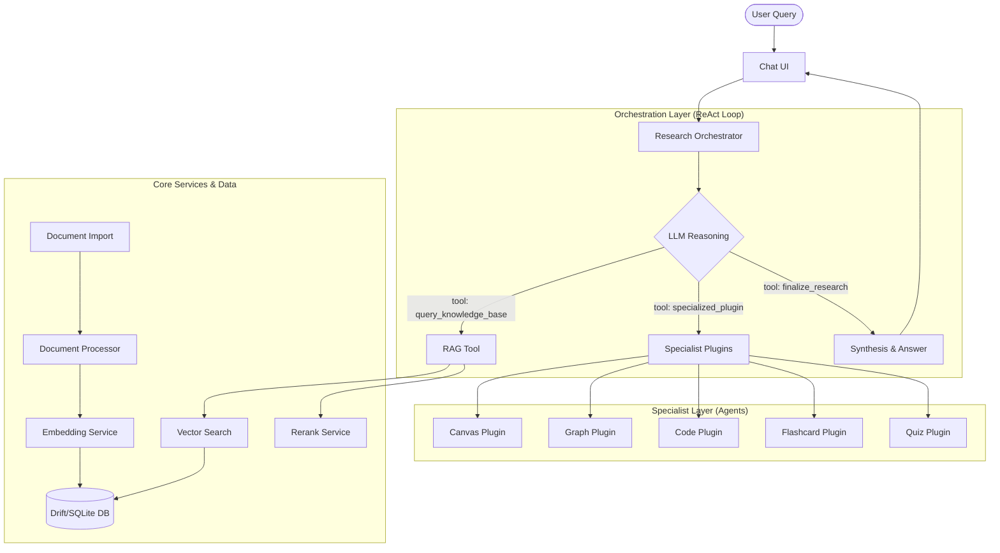

# Sift

**Sift** is a privacy-first AI research assistant designed to turn your local document library into an actionable knowledge base. Built with a sophisticated orchestration layer, Sift performs iterative research, visualizes data, and builds specialized tools to help you discover insights.

---

## Getting Started

Follow these steps to perform your first research cycle with Sift:

1.  **Configure AI Backend**: On first launch, choose your preferred AI engine. You can connect to an **External Server** (e.g., LM Studio or llama.cpp) or use the **Internal Engine** for a fully local experience.
2.  **Create a Collection**: Click the **+ (New Collection)** button. Collections are the high-level containers for your research projects.
3.  **Import Documents**: Select your new collection and click **View Documents**. Import the PDFs, Markdown, or text files you want Sift to analyze. Sift will automatically chunk and embed these for high-performance retrieval (RAG).
4.  **Start Researching**: Head back to the chat, ensure your collection is active, and ask your first question. Sift will iteratively search your documents to build a comprehensive answer.

---

## Key Features

### Iterative Research Orchestrator
Sift employs a powerful **ReAct (Reasoning + Acting) loop** to handle complex queries. Instead of a single pass, the `ResearchOrchestrator` performs multiple cycles of:
1.  **Context Analysis**: Understanding the nuances of your query.
2.  **RAG Search**: Querying the local database for relevant document chunks.
3.  **Reasoning**: Evaluating the findings and refining subsequent searches until the information is complete.

### Specialized AI Agents
When research is complete, Sift can delegate work to specialized agents to provide high-value outputs:
*   **Graph Generator**: Automatically transforms raw data into beautiful, insightful graphs and networks.
*   **Code Specialist**: Handles technical implementations, script generation, and code explanations.
*   **Flash Card**: Bridges the gap between research and learning by generating custom-designed flashcard decks.
*   **Quiz**: Helps reviews knowledge by creating a custom list of question based on the documents.
*   **Canvas**: Designs dynamic HTML/SVG visual components directly in the workspace for interactive discovery and problem-solving.

### Local Knowledge Base
*   **Privacy First**: Sift uses a local **Drift (SQLite)** database to store and index your documents.
*   **Contextual RAG**: High-performance retrieval-augmented generation ensures the AI always has the right context from your personal library.
*   **Document Support**: Native support for PDF, Markdown, and more.

---

## Supported Platforms

Sift is built for high-performance research across multiple platforms:
*   **Linux**: Native Linux (x64) support with full workspace capabilities.
*   **Windows**: Native Windows (x64) support.
*   **Android**: Mobile-optimized RAG and chat experience (APK).

---

## Technology Stack

*   **Frontend**: [Flutter](https://flutter.dev) for a smooth, multi-platform experience.
*   **State Management**: [Riverpod](https://riverpod.dev) for robust and testable logic.
*   **Database**: [Drift](https://drift.simonbinder.eu) (SQLite) for powerful local storage and RAG capabilities.
*   **AI**: Optimized for **Local LLMs** via any OpenAI-compatible endpoint (e.g., llama.cpp, vLLM, LM Studio).
*   **UI/UX**: Rich visualizations using `flutter_markdown`, `syncfusion_flutter_pdf`, and custom SVG/HTML rendering.

---

## Architecture

Sift follows a clean, domain-driven architecture:
*   **Orchestration Layer**: Manages the high-level research flow and multi-step reasoning.
*   **Specialist Layer**: Decoupled agents focused on specific output types (Graphs, Code, etc.).
*   **Core Services**: Abstracted interfaces for AI, Embeddings, and Reranking, allowing for easy swaps between different local or cloud providers.

---
